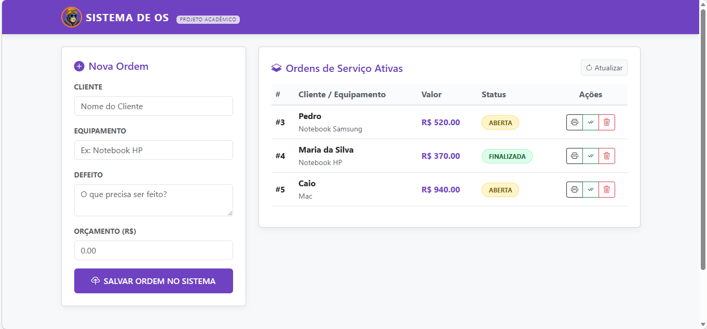

# 🛠️ Sistema de Gestão de OS (Ordem de Serviço)

Um sistema **Full-Stack** direto ao ponto para quem precisa organizar assistências técnicas e serviços. O foco aqui foi criar algo que seja rápido de usar, bonito de olhar e com um código muito limpo usando **Java e Spring Boot**.

> 💡 **Pra quem está olhando:** Esse projeto foi feito para colocar em prática meus estudos em Engenharia de Software. Ele usa banco de dados em memória (H2), então é só baixar e dar o play para testar tudo na hora, sem complicação!

### **Backend**
* **Java 17 & Spring Boot 3**: A dupla dinâmica para criar APIs que não travam e escalam de verdade.
* **Spring Data JPA**: Para salvar e buscar os dados no banco sem dor de cabeça.
* **H2 Database**: Banco de dados que roda "ao vivo" na memória. Perfeito para testar rápido.

### **Frontend**
* **HTML5 & CSS3**: Estilização personalizada com a minha paleta (Roxo e Laranja).
* **Bootstrap 5**: Deixando tudo responsivo para funcionar bem no PC ou no celular.
* **JavaScript Puro (Vanilla)**: Usei `Fetch API` para o site conversar com o Java sem precisar ficar dando F5 na página.

## ⚙️ O que o sistema faz? (CRUD Completo)

Dá para gerenciar todo o ciclo de uma Ordem de Serviço:
1.  **Cadastrar**: Salva novas ordens rapidinho.
2.  **Listar**: Mostra tudo o que está rolando na oficina em tempo real.
3.  **Finalizar**: Muda o status de "Aberta" para "Finalizada" com um clique.
4.  **Excluir**: Limpa o que não precisa mais.
5.  **Imprimir**: Gera uma versão pronta para entregar o comprovante pro cliente.

## 📐 Arquitetura

Organizei o projeto seguindo o padrão **MVC**, separando bem o que é dado (**Model**), o que é banco (**Repository**) e o que é rota (**Controller**). Isso deixa o código muito mais fácil de manter e evoluir.

## 👨‍💻 Desenvolvedor

**Jason Ferraz** | *Estudante de Engenharia de Software* Focado em transformar café em sistemas que resolvem problemas reais.

---

### 🤝 Bora trocar uma ideia?

